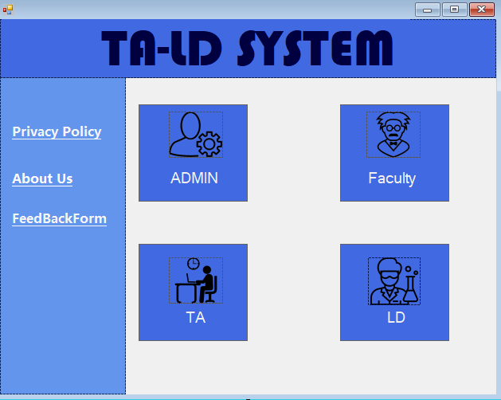
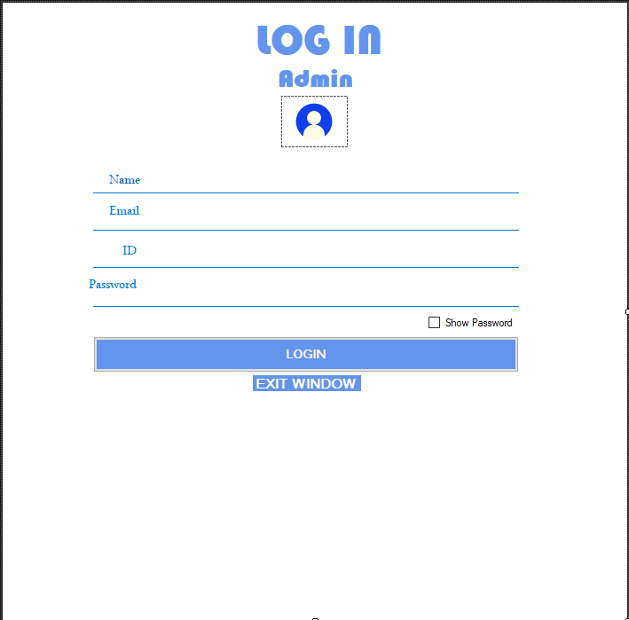
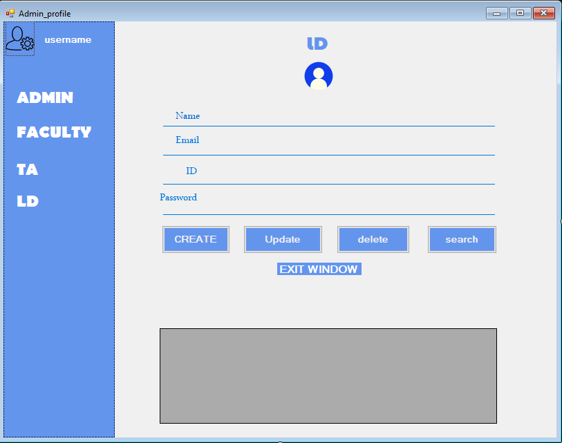
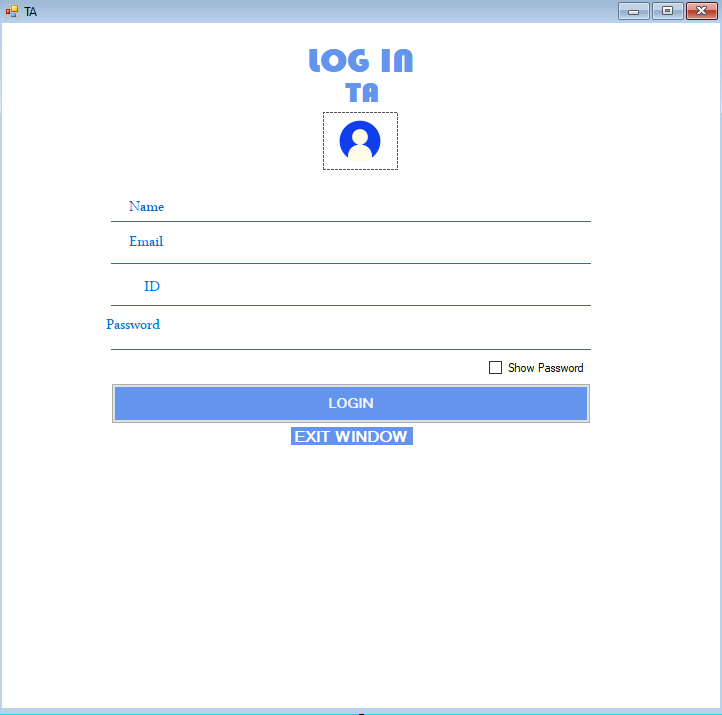
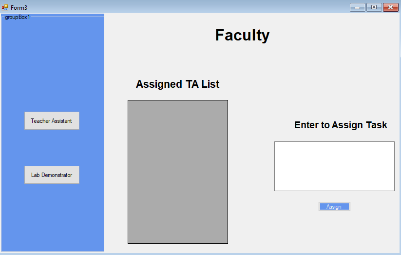

# LD/TA_TASK-ASSIGNER
## Project info
    This project was done on visual studio on C# using winform on .Netframework
    project goal was to digitilize and streamline the assignment of task to TA/LD.
## Application workflow
    The Admin has been assigned to able to have CRUD feature for all LD,TA and FACULTY
    Faculty can assign task to LD and TA.
    when task are finished LD and TA can check and submit their task.
## Database
    The data is being locally saved in SQL based databased system, for us we use MSSQL.
## TEAM
- Nouman Ahmad aka [nouman-x-ahmad](https://github.com/nouman-x-ahmad)
- Shaffin Imam aka [shaffinX](https://github.com/shaffinX?tab=overview&from=2024-04-01&to=2024-04-19)
## Images
### HOME PAGE(STARTER PAGE)

### LOGIN PAGE FOR ADMIN

### ADMIN PAGE FOR CRUD

### LOGIN PAGE FOR TA
similar design for ld and faculty page

### TASK ASSIGNER

## SETUP
To set up the project:

- Clone the repository.
- Open the solution in Visual Studio.
- Set up the database by running the provided SQL scripts.
- Update the connection string
- Build and run the project.
